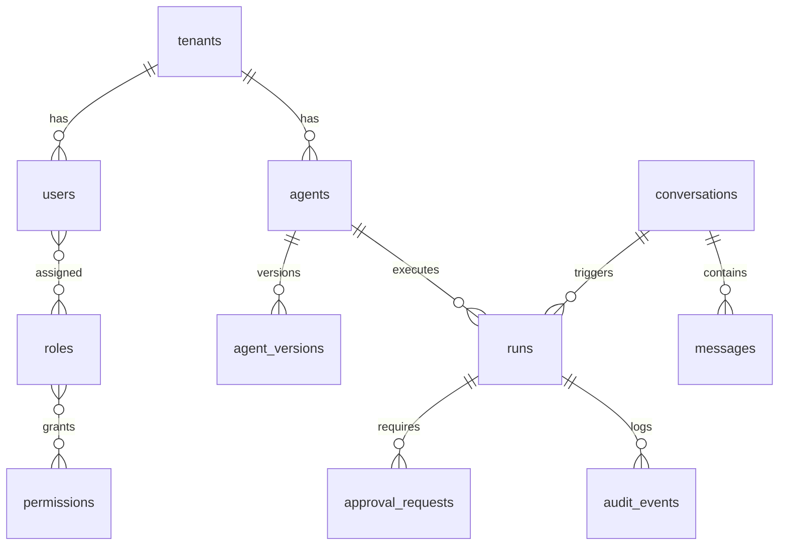

# 数据库设计

_负责人：数据平台团队｜状态：基线设计｜版本：v1.1｜最后更新：2026-08-24_

---

## 选型与原则

PostgreSQL 为事务主库；Redis 只保存缓存、队列、锁和短期限流状态；对象存储保存附件和大文件；pgvector 或独立向量库保存向量。业务事实不能只存在 Redis。所有租户表含 `tenant_id`，仓储层强制注入租户条件。

## 核心表分期

### 阶段 0.2

`tenants`、`users`、`roles`、`permissions`、`role_permissions`、`agents`。

### 阶段 1

`teams`、`skills`、`tools`、`tool_policies`、`conversations`、`messages`、`runs`。

### 阶段 2

`agent_versions`、`skill_versions`、`approval_requests`、`usage_records`、`audit_events`。

### 阶段 3+

`knowledge_bases`、`knowledge_documents`、`workflows`、`channels`、`bindings`、`plugins`、配额和市场表。

## 字段规范

- 主键使用不可预测 ID（UUID/ULID/CUID），不使用自增 ID 暴露业务顺序。
- 所有业务表含 `created_at`、`updated_at`；可删除对象使用 `deleted_at` 软删除。
- 状态使用受限枚举或数据库 CHECK，禁止任意字符串状态。
- 金额使用整数最小货币单位；时间统一 UTC。
- JSON 只用于版本化定义或供应商扩展；可查询字段必须结构化列并建立索引。
- 租户级唯一约束必须使用复合唯一键，例如 `(tenant_id,email)`。

## 关键关系

`Tenant -> User/Agent/Skill/Conversation/Run`；`Agent -> AgentVersion/Conversation/Run`；`Conversation -> Message/Run`；`AgentVersion -> SkillVersion/ToolPolicy`；`Run -> ApprovalRequest/UsageRecord/AuditEvent`。发布版本不可变，草稿修改生成新版本，不覆盖已运行版本。

## 索引与隔离

常用索引为 `(tenant_id,status)`、`(tenant_id,created_at)`、`(tenant_id,created_by)`。所有列表接口必须分页。高敏感表按租户过滤；生产环境可增加 PostgreSQL Row-Level Security，但不能替代应用层授权。

跨租户资源的读取和更新统一采用“不确认存在性”策略：资源查询返回 `404 NOT_FOUND`；已确认资源但动作不允许时返回 `403 FORBIDDEN`。API、WebSocket、前端和测试用例必须遵守同一规则。

## 阶段 0.2 最小表定义

以下是迁移和 Prisma Schema 必须实现的最小字段契约；完整约束、外键和索引以迁移文件为准。

| 表 | 必填字段 | 关键约束 |
|---|---|---|
| `tenants` | `id,name,slug,status,created_at,updated_at,deleted_at` | `slug` 唯一；状态为 active/suspended/deleted |
| `users` | `id,tenant_id,email,display_name,status,created_at,updated_at,deleted_at` | `(tenant_id,email)` 唯一；密码哈希可为空以支持 SSO |
| `roles` | `id,tenant_id,name,is_system,created_at,updated_at` | `(tenant_id,name)` 唯一；权限通过 `role_permissions` 关联 |
| `permissions` | `id,code,resource,action,scope,created_at` | `code` 全局唯一；系统权限不可删除 |
| `agents` | `id,tenant_id,name,status,config,created_by,visibility,created_at,updated_at,deleted_at` | `(tenant_id,name)` 唯一；发布版本通过外键引用 `agent_versions` |

角色与权限使用关系表而非把权限 ID 数组塞进 JSONB，避免无法建立外键和难以审计变更。软删除对象的业务唯一性应使用“未删除部分唯一索引”，而不是普通唯一约束。

## 核心关系 ER 图

## RLS 与连接池

RLS 仅作为纵深防御。启用时使用事务级 `SET LOCAL app.tenant_id`，并禁止应用连接角色绕过 RLS；每个事务结束自动清除上下文。应用层仍必须执行资源级 RBAC、团队关系和审计检查。连接池中不得使用会泄漏到下一请求的会话级 `SET`。

## 迁移与索引规范

迁移采用 `{timestamp}_{description}` 命名，按 expand -> backfill -> switch -> contract 分阶段执行；破坏性操作必须有回滚或明确的恢复方案。外键、租户过滤、状态和时间排序列按查询计划建立复合/部分索引，发布前用 `EXPLAIN` 验证，禁止未经压测批量 `REINDEX`。

## 迁移和备份

迁移必须前向可执行、可回滚，并在 CI 使用空库和上一版本数据库各跑一次。生产迁移禁止破坏性一步完成；先扩展、回填、切换、再清理。数据库每日全量备份、连续 WAL/PITR，定期做恢复演练并记录 RTO/RPO。

## 验收标准

- 跨租户查询返回 `404 NOT_FOUND`；已定位资源但动作不允许返回 `403 FORBIDDEN`，且不泄露资源存在性。
- 发布 AgentVersion 后修改草稿不会改变历史 Run。
- 迁移可在测试环境执行和回滚。
- 备份可以恢复到独立环境，恢复结果通过数据一致性检查。
