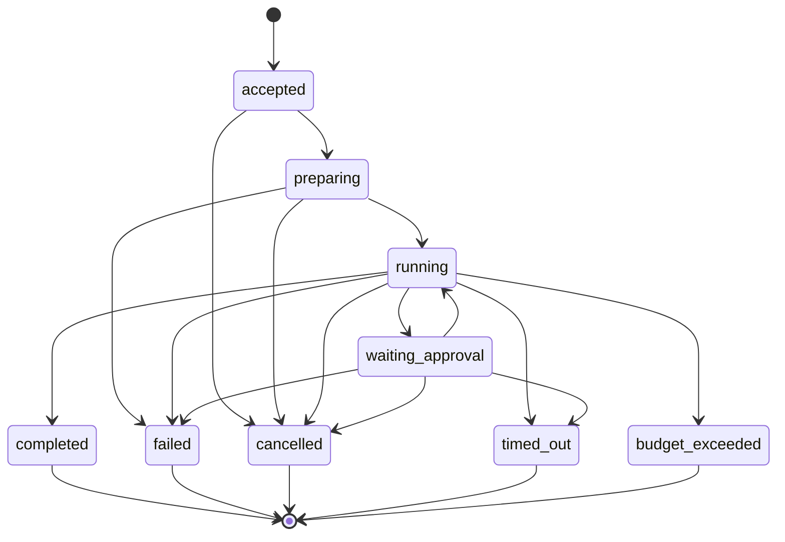

# Runtime 状态机契约

_负责人：Runtime 团队｜状态：契约冻结｜版本：v1.0｜最后更新：2026-08-24_

本文件是 Run、Tool Call 和 Workflow 节点状态的唯一事实源。实现、OpenAPI、事件 Schema 和合同测试必须引用本文件；状态名称不得在服务间改名。

## Run 状态

| 状态 | 含义 | 允许的下一状态 |
|---|---|---|
| `accepted` | 已通过请求校验，等待执行 | `preparing`, `cancelled` |
| `preparing` | 正在生成版本/权限/预算快照 | `running`, `failed`, `cancelled` |
| `running` | 执行模型、Workflow 或 Tool | `waiting_approval`, `completed`, `failed`, `cancelled`, `timed_out`, `budget_exceeded` |
| `waiting_approval` | 等待有效审批决定 | `running`, `failed`, `cancelled`, `timed_out` |
| `completed` | 结果和审计已持久化 | 终态，不可迁移 |
| `failed` | 不可恢复错误或拒绝 | 终态；新尝试必须创建新 Run 或 attempt |
| `cancelled` | 服务端确认取消 | 终态 |
| `timed_out` | 超过 Run 或节点时限 | 终态 |
| `budget_exceeded` | 达到 Token、成本或调用次数上限 | 终态 |

每次迁移使用 `run_id + attempt_id + checkpoint_version` 条件更新；重复迁移返回当前状态，不重复执行副作用。终态记录必须先提交事务，再发送事件。

## Tool Call 状态

`created -> validating -> pending_approval | executing | rejected`

`pending_approval -> executing | rejected | expired`

`executing -> succeeded | failed | timed_out`

`failed -> retry_scheduled | permanently_failed`

Tool Call 只有 `succeeded`、`rejected`、`expired`、`permanently_failed` 和 `timed_out` 可作为终结状态。副作用 Tool 必须携带 `idempotency_key`，重试前查询事实记录；不得因客户端重连重复执行。

## Workflow 节点状态

`pending -> ready -> running -> succeeded | failed | skipped`

条件边只能基于已持久化的节点输出和策略结果计算。并行节点必须写入独立字段；汇聚节点在所有必需前置节点终态后才可运行。节点失败默认终止 Run，只有声明 `on_error=continue` 的非关键节点可以转为 `skipped` 或继续。

## 取消、恢复和审批

- 取消是幂等操作；服务端先写取消意图，再向 Worker/Sandbox 传播，最终以事实状态为准。
- 恢复可以指定当前 Run 已持久化的任意 checkpoint 版本；恢复前必须重新校验租户、权限、AgentVersion 和 ToolDefinition 的当前有效性。
- 审批决定绑定 `approval_request_id + snapshot_id + tool_call_id`，令牌只允许消费一次；审批后权限撤销时仍必须拒绝执行。
- 客户端断线不改变 Run 状态；恢复窗口过期返回 `RESUME_WINDOW_EXPIRED`，客户端重新查询 Run。

## 最小验收矩阵

| 场景 | 预期结果 |
|---|---|
| 重复创建 Run 请求 | 同一 `Idempotency-Key` 返回同一 `run_id` |
| 并发审批 | 只有一个请求成功，其余返回 `APPROVAL_ALREADY_HANDLED` |
| Worker 重启 | 从 checkpoint 恢复，不重复成功的副作用 Tool |
| 跨租户 Run 查询 | `404 NOT_FOUND` 且写入拒绝审计 |
| 超时/预算 | 进入对应终态，终态事件只发送一次 |
